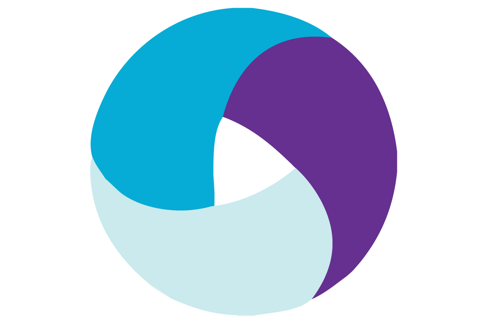

<h1 align="center">👋 Привет! Меня зовут Сергей</h1>

  <em>QA Engineer (Junior Automation, Java) | Студент школы <a href="https://qa.guru/">QA.GURU</a> | Изучаю искусственный интеллект 🤖</em>

---

### ⚙️ Немного обо мне

- 🎯 Цель — стать сильным инженером по автоматизации тестирования
- 📚 Углубляюсь в **Java (core и автотесты), Selenide, JUnit5, REST API, CI/CD (Jenkins, Allure, Selenoid)** и построение
  тестовой инфраструктуры
- 🤝 Открыт к интересным проектам и коллаборациям
- 💡 Активно развиваюсь в сторону AI в тестировании и обучении

---

### 📊 GitHub Статистика

  
  

---

### 🚀 Мои учебные проекты

- Проекты с автотестами на DEMOQA:
    - [UI тесты](https://github.com/arane1223/demoqa-Jenkins-HW11)
    - [API тесты](https://github.com/arane1223/REST-API-DEMOQA)
    - [UI+API тесты](https://github.com/arane1223/UI-API-DEMOQA)
- [UI автотесты для мобильного приложения Wikipedia](https://github.com/arane1223/Mobile-Wiki)
- [UI тесты на petrolplus.ru](https://github.com/arane1223/UI-petrolplus)
- [Игра «Крестики-нолики» с юнит-тестами](https://github.com/arane1223/TicTacToe)

---

### 🧰 Технологический стек

  
  
  
  
  
  
  
  
  
  
  
  
  
  
  
  

---

### 📬 Контакты

- Telegram: [@sergey_gluhov](https://t.me/sergey_gluhov)
- ВКонтакте: [sergey_gluhov](https://vk.com/sergey_gluhov)

---

## 🐍 GitHub Activity Snake

  <picture>
    <source media="(prefers-color-scheme: dark)" srcset="https://raw.githubusercontent.com/arane1223/arane1223/output/github-contribution-grid-snake-dark.svg">
    <source media="(prefers-color-scheme: light)" srcset="https://raw.githubusercontent.com/arane1223/arane1223/output/github-contribution-grid-snake.svg">
    
  </picture>
   
  <em>✨ Обновляется автоматически каждый день — следит за моей активностью на GitHub</em>

